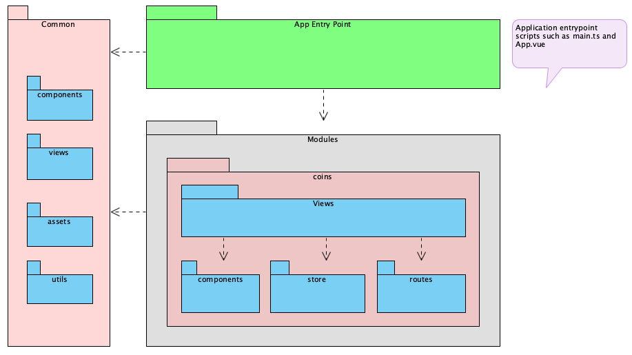

# CoinGecko DeFI Copycat

## Pipeline status

- `main` - 
- `develop` - 
- `sonarqube` 

## Docs

- [Setup](./docs/setup.md)

## Architecture

- Common: It contains the backbone of the whole application, including views, components, utils, styles, and any generic asset or script needed to assemble the application.
- Modules: It contains the implementation of the use cases bounded to the application.
- App entry point: It contains all the entry point scripts and components of the application.

## Project setup

- ✅ CI - Gitlab CI
- ✅ Commit linter - [Commitlint](https://commitlint.js.org/#/)
- ✅ Semantic releasesa and auto-versioning (semver) - [semantic-release](https://semantic-release.gitbook.io/semantic-release/)
- ✅ Static code analysis - [Sonarqube](https://sonarqube.changani.me/dashboard?id=firmino.changani_coingecko-defi-copycat-vue_AXuXrej-158ljRfCr3o9)
- ⚠️ Lighthouse analysis

## Environments

- Production [main] - https://coingecko-defi-copycat-vue.changani.me
- Staging [develop] - https://dev.coingecko-defi-copycat-vue.changani.me
